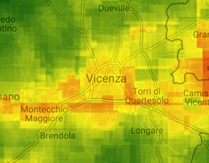

# Osservazione degli inquinanti atmosferici nel vicentino mediante i dati satellitari Copernicus

**Esplora e compara i livelli della concentrazione di vari costituenti atmosferici nel territorio vicentino e veneto usando la [nostra web app](https://vicenzainnovationlab.users.earthengine.app/view/monitoraggio-aria) basata su Google Earth Engine, una piattaforma big data, e immagini satellitari europei.**

## Indice
1. [Finanziamento](#finanziamento)
2. [Introduzione](#introduzione)
3. [Struttura del repository](#struttura-del-repository)
4. [Come usare la web app](#come-usare-la-web-app)
5. [Come usare il codice sorgente](#come-usare-il-codice-sorgente)
6. [Contatti](#contatti)
7. [Ringraziamenti](#ringraziamenti)
8. [Licenza](#licenza)

## Finanziamento

Il progetto è parte del Programma Operativo Regionale del Fondo Europeo di Sviluppo Regionale (POR FESR 2014 - 2020) del Veneto, nell'ambito del bando dell'azione 231 volto alla "costituzione di Innovation Lab diretti al consolidamento/sviluppo del network Centri P3@-Palestre Digitali e alla diffusione della cultura degli Open Data."

## Introduzione

Vari gas e aerosol sono componenti integranti dell'atmosfera. L'aumento della loro concentrazione può portare a conseguenze desolanti sulla salute. Il monitoraggio satellitare di tali componenti dell'atmosfera aiuta a tenere d'occhio questa situazione dinamica. [Sentinella-5P](https://sentinel.esa.int/web/sentinel/missions/sentinel-5p), il nuovo satellite del Copernicus, un programma europeo di osservazione della Terra, ci offre una grande opportunità per farlo.

Questo repository contiene il codice JavaScript che abbiamo utilizzato per l'elaborazione dei dati e per generare la web app. Consente di studiare i livelli di NO₂, CO, SO₂, metano, formaldeide, ozono, nuvolosità e indice di aerosol assorbenti, ottenuti e elaborati tramite Earth Engine dai dati satellitari Sentinel-5P in tempo quasi reale.

## Struttura del repository

- `img/` - cartella con le immagini usate nel readme
- `code.js` - codice della web app
- `LICENSE.md` - file della licenza
- `README.md` - questo file

## Come usare la web app

SCREENSHOT

## Come usare il codice sorgente

Il codice è stato sviluppato per essere eseguito all'interno della  piattaforma big data che si chiama [Google Earth Engine](https://earthengine.google.com/). In caso se vuoi esaminare gli algoritmi sottostanti o produrre una web app derivata è necessario avere un account gratuito Earth Engine. Se vuoi invece solo utilizzare la web app, basta [aprire il link](https://vicenzainnovationlab.users.earthengine.app/view/monitoraggio-aria).

Non appena hai l'account Earth Engine, esplora la sua interfaccia con [questo manuale](https://developers.google.com/earth-engine/guides/playground). Poi basta copiare il codice dal file `code.js` da questo repo a uno script Earth Engine per esiguirlo.

## Contatti

- Progetto nel sito del comune: [VicenzaInnovationLab](https://www.comune.vicenza.it/uffici/cms/innovationlabvicenza.php)
- Sviluppatore: [Yaroslav Vasyunin](https://www.linkedin.com/in/vasyunin), Digital Innovation Hub di Confartigianato Vicenza ([digitalinnovationhubvicenza.it](https://digitalinnovationhubvicenza.it/))

## Ringraziamenti
Lo sviluppatore ringrazia *Vasily Lobanov*, Centro Earth Observation della RUDN University (Russia), per il prezioso sopporto nello sviluppo della interfaccia grafica della web app.

## Licenza

La IODL 2.0 (Italian Open Data License) prevede che l’utente possa liberamente:

- consultare, estrarre, scaricare, copiare, pubblicare, distribuire e trasmettere le informazioni;
- creare un lavoro derivato, per esempio attraverso la combinazione con altre informazioni (c.d. mashup), includendole in un prodotto o sviluppando un’applicazione informatica che le utilizzi come base dati.

In cambio, all’utente è chiesto solo d'indicare la fonte delle informazioni e il nome del soggetto che fornisce il dato, includendo, se possibile, un link alla licenza. Vedi il file [LICENSE.md](LICENSE.md) per dettagli.
