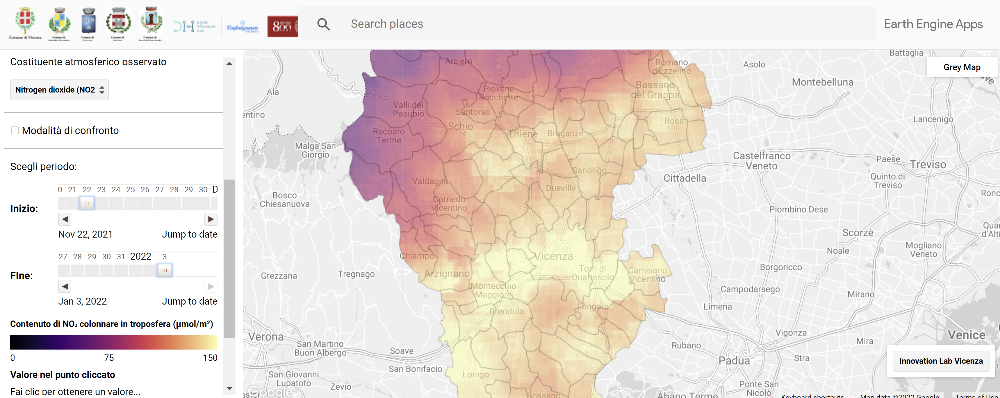
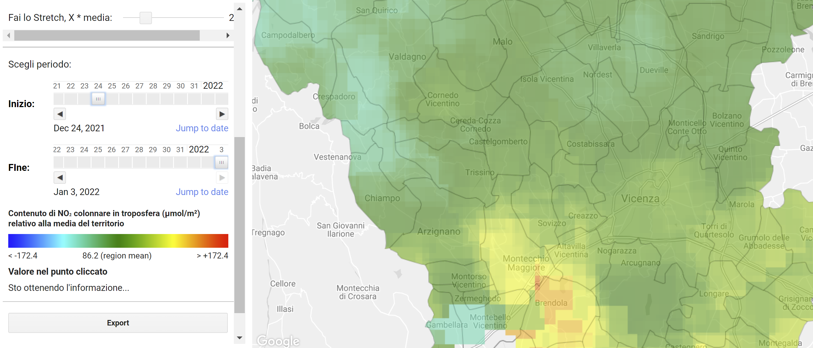

<h1 align="center">Osservazione degli inquinanti atmosferici nel vicentino mediante i dati satellitari Copernicus</h1>

a cura del <a href="https://digitalinnovationhubvicenza.it/">Digital Innovation Hub Vicenza</a>

Esplora e compara i livelli della concentrazione di vari costituenti atmosferici nel territorio vicentino e veneto usando la nostra web app basata su Google Earth Engine, una piattaforma Big Data, e immagini satellitari europei.

[

](https://vicenzainnovationlab.users.earthengine.app/view/monitoraggio-aria)

<i>Il progetto è parte del Programma Operativo Regionale del Fondo Europeo di Sviluppo Regionale (POR FESR 2014 - 2020) del Veneto, nell'ambito del bando dell'azione 231 volto alla "costituzione di Innovation Lab diretti al consolidamento/sviluppo del network Centri P3@-Palestre Digitali e alla diffusione della cultura degli Open Data."</i>

## Indice
1. [Introduzione](#introduzione)
2. [Web App](#web-app)
   1. [Come usare la web app](#come-usare-la-web-app)
   2. [Come interpretare la mappa](#come-interpretare-la-mappa)
      1. [Modalità normale](#modalità-normale)
      2. [Modalità di confronto](#modalità-di-confronto)
3. [Codice sorgente](#codice-sorgente)
   1. [Struttura del repository](#struttura-del-repository)
   2. [Come usare il codice sorgente](#come-usare-il-codice-sorgente)
4. [Licenza](#licenza)
5. [Contatti](#contatti)
6. [Ringraziamenti](#ringraziamenti)

## Introduzione

Vari gas e aerosol sono componenti integranti dell'atmosfera. L'aumento della loro concentrazione può portare a conseguenze devastanti sulla salute. Il monitoraggio satellitare di tali componenti dell'atmosfera aiuta a tenere d'occhio questa situazione in maniera dinamica. [Sentinel-5P](https://sentinel.esa.int/web/sentinel/missions/sentinel-5p), il nuovo satellite del programma europeo di osservazione della Terra Copernicus ci offre una grande opportunità per farlo.

Questo repository contiene il codice JavaScript che abbiamo utilizzato per l'elaborazione dei dati e per generare la web app. Consente di osservare la distribuzione dei vari componenti della troposfera (NO₂, CO, SO₂, metano, formaldeide, ozono, nuvolosità) a partire da 2018. I dati da Sentinel-5P arrivano in tempo quasi reale, ottenuti ed elaborati tramite Earth Engine.

## Web App

**La web app è dedicata allo studio della distribuzione relativa di diverse sostanze nella troposfera. Non mostra il superamento delle concentrazioni massime ammissibili, però può essere utilizzata con dati provenienti da altre fonti per ottenere un quadro completo dell'inquinamento dell'aria.**

### Come usare la web app

L'applicazione è composta da un pannello di controllo a sinistra e da una finestra della mappa a destra. Quando la web app è aperta (potrebbero volerci alcuni secondi per caricarla), appare una mappa della provincia di Vicenza.

Nel pannello è possibile:

- Scegliere il territorio di interesse - l'intera regione del Veneto, una provincia separata o un comune separato.
- Selezionare il costituente troposferico di interesse. Per impostazione predefenita è selezionato il contenuto NO₂ colonnare.
- Scegliere il periodo. Nonostante il fatto che per il territorio del Nord Italia le riprese spaziali avvengano quotidianamente, la presenza di nuvole rende difficile osservare l'inquinamento sottostante. Pertanto, è necessario aggregare i valori in una settimana o anche di più. A tale scopo, utilizza questo strumento per selezionare le date di inizio e di fine del periodo. Per impostazione predefinita, vengono usati gli ultimi 10 giorni.
- Esplorare la legenda abbinando colori e i loro significati alla mappa.
- Cliccare sulla mappa e visualizzare sul pannello i valori misurati nel punto.
- Esportare il risultato per il punto cliccato in un file CSV.
- Utilizzare la **modalità di confronto**. Questa modalità consente di mostrare le aree il cui livello di concentrazione differisce dal valore medio per il periodo selezionato in una determinata area.

### Come interpretare la mappa

#### Modalità normale
Quando la modalità di confronto non è accesa, i colori sulla mappa dimostrano la concentrazione media del costituente prescelto nel periodo selezionato. I vari costituenti sono espressi con diverse unità di misura, quindi leggi accuratamente la legenda.

#### Modalità di confronto
Quando la modalità di confronto è accesa, i colori sulla mappa dimostrano la deviazione dalla media (verde) sia in alto (rosso) che in basso (blu).

Lo slider "Fai lo Stretch" permette di sperimentare con la gamma di colore, aumentando il contrasto se necessario per evidenziare dei cambiamenti lievi.

## Codice sorgente

### Struttura del repository

- `img/` - cartella con le immagini usate in questo Readme
- `code.js` - codice della web app per Earth Engine
- `LICENSE.md` - file della licenza
- `README.md` - questo file

### Come usare il codice sorgente

Il codice è stato sviluppato per essere eseguito all'interno della  piattaforma Big Data che si chiama [Google Earth Engine](https://earthengine.google.com/). In caso se vuoi esaminare gli algoritmi sottostanti o produrre una web app derivata è necessario avere un account gratuito Earth Engine. Se vuoi invece solo utilizzare la web app, basta [aprire il link](https://vicenzainnovationlab.users.earthengine.app/view/monitoraggio-aria).

Non appena hai l'account Earth Engine, esplora la sua interfaccia con [questo manuale](https://developers.google.com/earth-engine/guides/playground). Poi basta copiare il codice dal file `code.js` da questo repository a uno script Earth Engine per eseguirlo.

## Licenza

La IODL 2.0 (Italian Open Data License) prevede che l’utente possa liberamente:

- consultare, estrarre, scaricare, copiare, pubblicare, distribuire e trasmettere le informazioni;
- creare un lavoro derivato, per esempio attraverso la combinazione con altre informazioni (c.d. mashup), includendole in un prodotto o sviluppando un’applicazione informatica che le utilizzi come base dati.

In cambio, all’utente è chiesto solo d'indicare la fonte delle informazioni e il nome del soggetto che fornisce il dato, includendo, se possibile, un link alla licenza. Vedi il file [LICENSE.md](LICENSE.md) per dettagli.

## Contatti

- Sito ufficiale: [InnovationLab Vicenza - Comune di Vicenza](https://www.comune.vicenza.it/uffici/cms/innovationlabvicenza.php)
- Sito sviluppatore: [Digital Innovation Hub Vicenza](https://digitalinnovationhubvicenza.it/)
- Email ufficiale: <vicenzainnovationlab@comune.vicenza.it>
- Email sviluppatore: <info@digitalinnovationhubvicenza.it>

## Ringraziamenti

Ringraziamo [Vasily Lobanov](https://www.linkedin.com/in/lobanov-v/) del Centro Earth Observation della [RUDN University](https://eng.rudn.ru/) per il prezioso supporto nello sviluppo della interfaccia grafica della web app.
