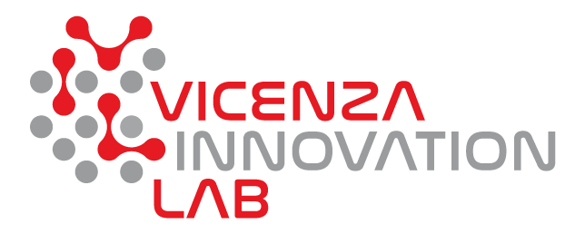

# InnovationLab Vicenza: Osservazione degli inquinanti atmosferici i dati satellitari Copernicus

**Esplora e compara i livelli della concentrazione di vari costituenti atmosferici nel territorio vicentino e veneto usando la [nostra web app](https://code.earthengine.google.com/), basata sulla piattaforma cloud Google Earth Engine e dati satellitari europei.**

> Il progetto è parte del Programma Operativo Regionale del Fondo Europeo di Sviluppo Regionale (POR FESR 2014 - 2020) del Veneto, nell'ambito del bando dell'azione 231 volto alla "costituzione di Innovation Lab diretti al consolidamento/sviluppo del network Centri P3@-Palestre Digitali e alla diffusione della cultura degli Open Data."

Questo repository contiene il codice JavaScript necessario per l'elaborazione dei dati e per generare la Web App. Il codice è sviluppato per essere eseguito all'interno della  piattaforma Big Data che si chiama [Google Earth Engine](https://earthengine.google.com/). È necessario avere un account gratuito Earth Engine per usarlo.

Il codice consente di studiare i livelli di NO₂, CO, SO₂, metano, formaldeide, ozono, nuvolosità e indice di aerosol assorbenti, ottenuti e elaborati tramite Earth Engine dai dati satellitari [Sentinel-5P](https://sentinel.esa.int/web/sentinel/missions/sentinel-5p) **in tempo quasi reale**.

## Contatti

- Sito del comune: [VicenzaInnovationLab](https://https://www.comune.vicenza.it/uffici/cms/innovationlabvicenza.php/)
- Sviluppatore: [Yaroslav Vasyunin](https://www.linkedin.com/in/vasyunin), Digital Innovation Hub di Confartigianato Vicenza ([digitalinnovationhubvicenza.it](https://digitalinnovationhubvicenza.it/))

## Ringraziamenti
Lo sviluppatore ringrazia Vasily Lobanov, Centro Earth Observation della RUDN University (Russia), per il prezioso sopporto nello sviluppo della interfaccia grafica della web app.

## Licenza

La IODL 2.0 (Italian Open Data License) prevede che l’utente possa liberamente:

- consultare, estrarre, scaricare, copiare, pubblicare, distribuire e trasmettere le informazioni;
- creare un lavoro derivato, per esempio attraverso la combinazione con altre informazioni (c.d. mashup), includendole in un prodotto o sviluppando un’applicazione informatica che le utilizzi come base dati.

In cambio, all’utente è chiesto solo d'indicare la fonte delle informazioni e il nome del soggetto che fornisce il dato, includendo, se possibile, un link alla licenza. Vedi il file [LICENSE.md](LICENSE.md) per dettagli.
